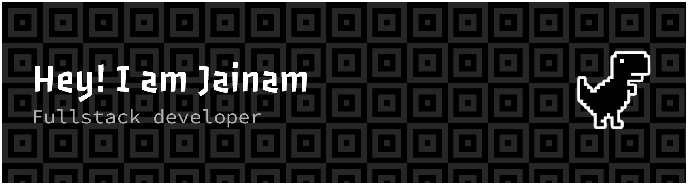
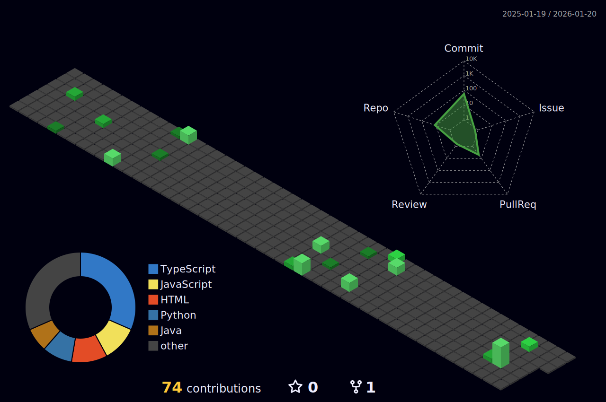

   
   
   
  

---

### 💫 About Me:
- 🔭 I’m currently working on **Drop Of Hope (Blood Donation Management System)**
- 🌱 I’m currently learning **Next Js, React Native, Supabase**
- 💬 Ask me about **React, Tailwind CSS, JavaScript, Java, Python**
- 📫 How to reach me: **kharajaynam@gmail.com**

---

### 💻 Tech Stack:

                                  

---

### 📊 GitHub Stats:

  

  

---

### ✍️ Random Dev Quote

  

